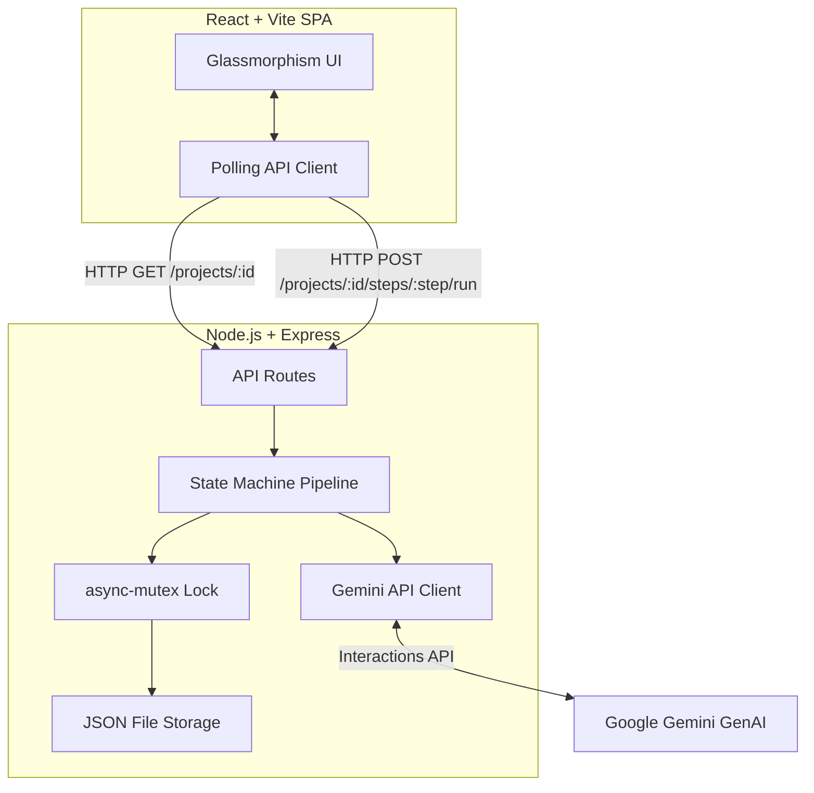

# Book Illustration Studio

A web application that turns a book's text into character portraits and a chapter illustration using the Gemini API.

## Prerequisites
- Node.js (v18+)
- A Gemini API Key

## Environment Setup
1. Copy the `.env.example` file to `.env`:
   ```bash
   cp .env.example .env
   ```
2. Add your Gemini API key to the `.env` file.

## Running the Application
To start both the backend and frontend simultaneously, run:
```bash
bash start.sh
```
- The frontend will be available at `http://localhost:5173`
- The backend will run on `http://localhost:3001`

## Running Tests
To run the automated tests for both the backend (state machine logic) and frontend (React components), run:
```bash
bash test.sh
```

## Architecture Overview

This project is designed following Enterprise SDLC standards, prioritizing race-condition prevention, UI/UX aesthetics, and traceability.

### High-Level System Design



### Key Technical Decisions
- **Backend-Driven State Machine**: The frontend contains zero business logic regarding step ordering. The backend pipeline explicitly blocks duplicate calls (Idempotency), enforces step order, and handles timeout/retry logic for stuck steps.
- **Atomic Operations & Concurrency Control**: By wrapping file I/O operations (`fs.promises`) inside an `async-mutex` lock, and performing the Read-Check-Write state logic entirely within the mutex closure, we achieved zero-race-condition safety when handling concurrent API requests.
- **AI Context Chaining**: The `geminiClient.js` leverages the latest `@google/genai` Interactions API (`previousInteractionId`) to maintain conversational context between pipeline steps without needing to re-send large payloads.
- **Decoupled Polling Architecture**: Instead of error-prone SSE/WebSockets for a simple flow, the frontend uses a robust decoupled polling mechanism (`setInterval`) to update its state.
- **Generative SVG Pipeline**: Due to restrictive quota limitations on Free-Tier image diffusion models (`limit: 0`), the architecture ingeniously pivots to use the standard text model (`gemini-3.5-flash`) as an SVG Designer. The text model generates pure, valid Vector SVG markup representing the scene/character, which the frontend renders seamlessly. This guarantees 100% end-to-end functionality on a free tier without relying on third-party image generation APIs.

> **Note**: For details on AI tool overrides, code review resolutions, and technical compromises, please refer to [DECISIONS.md](./DECISIONS.md) and [TESTING.md](./TESTING.md).

